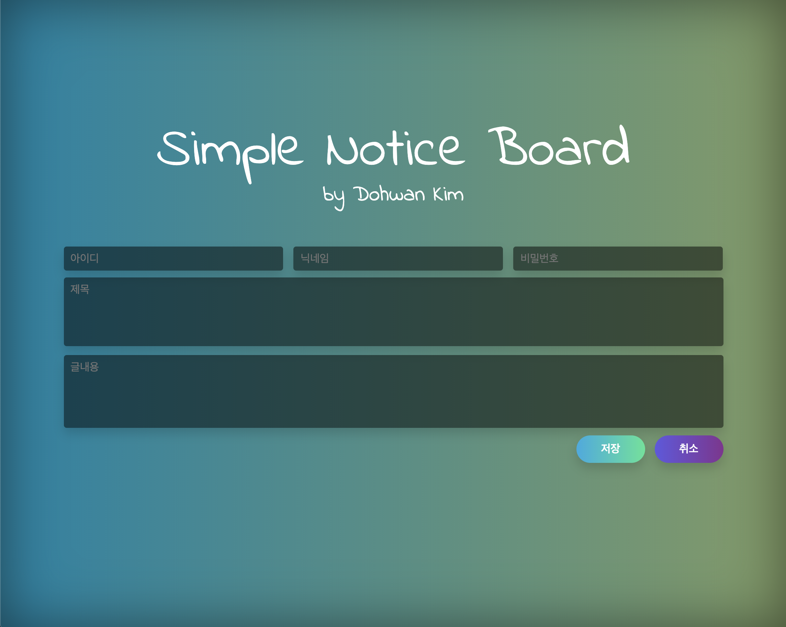

# node-express-simple-board
> simple comment board. (post, post delete, post modify)

Passwords made it possible to delete and modify.
It is also output without any problems on mobile devices.



## Sample (Heroku auto deploy)
https://node-express-simple-board.herokuapp.com/

## Installation
if you use OS X, you must install Xcode. (for @babel)

```sh
npm install --save
```


## Run project
The default port number is 4000.
```sh
npm run start
```

## Dev Description
It is composed of node express and JavaScript as MVC pattern.

and DB default is sqlite3 but also included mysql.


